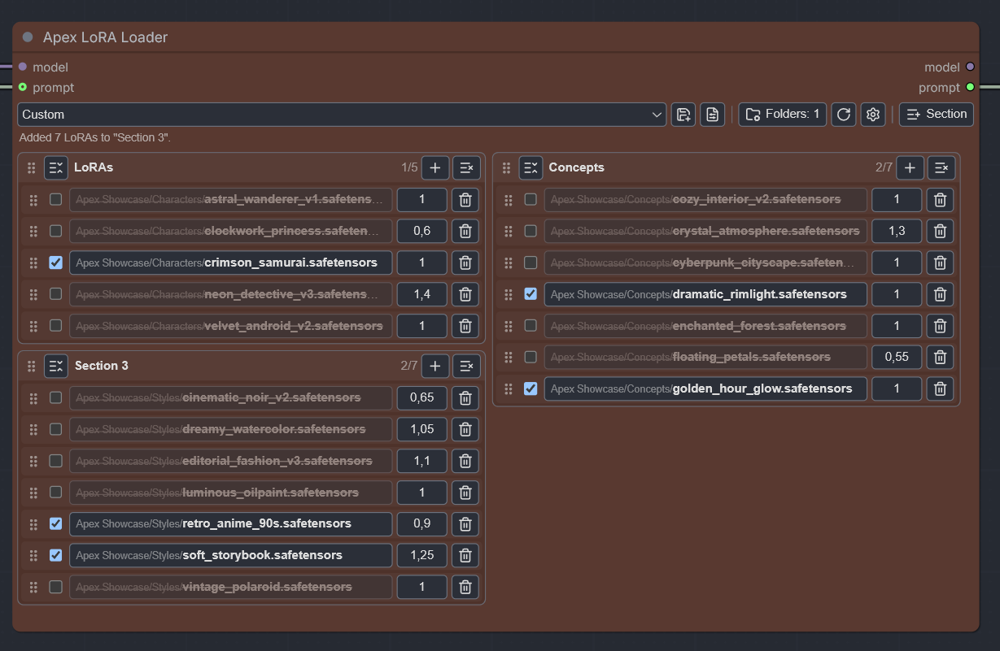
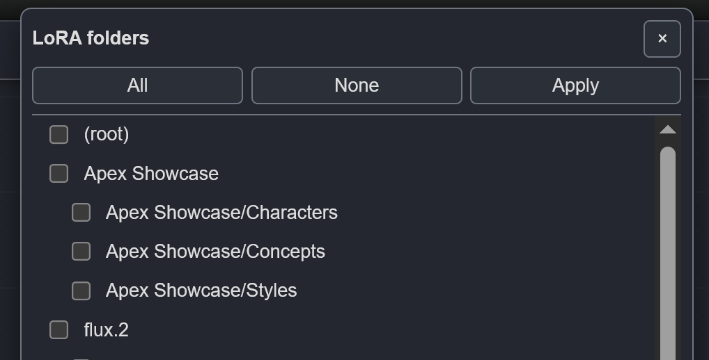
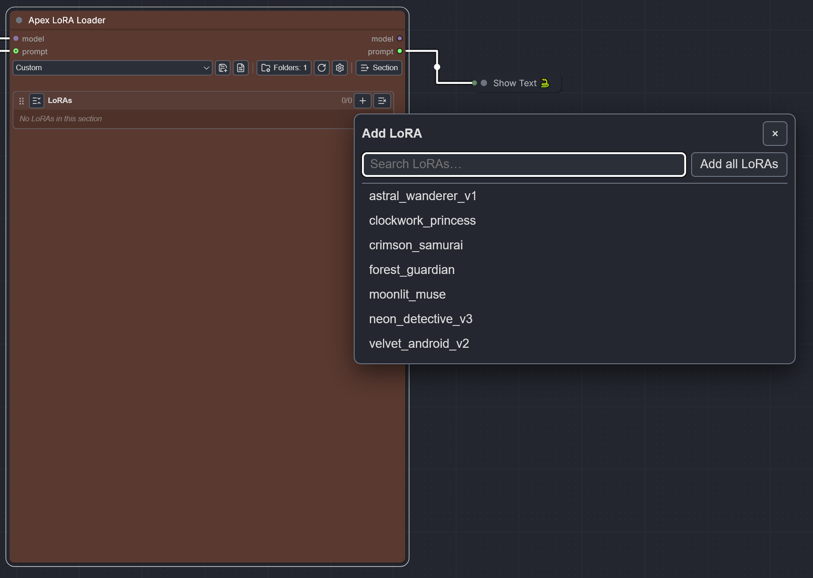
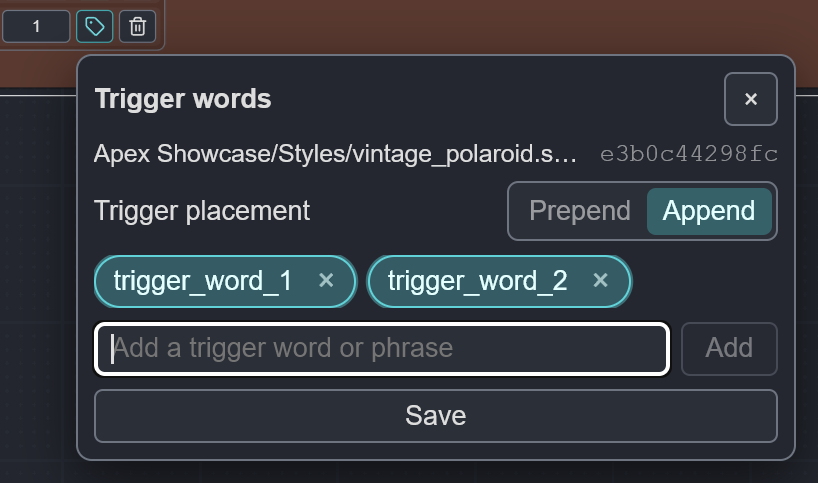
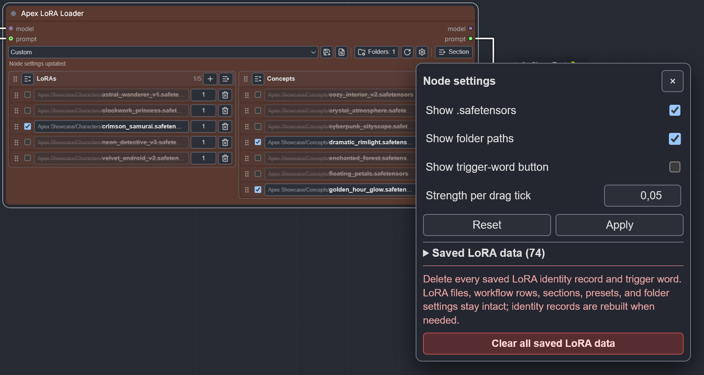

# Apex LoRA Loader

### A responsive, sectioned LoRA workspace for ComfyUI

Organize, filter, reorder, preset, recover, and annotate large LoRA stacks in one compact node.

[![License: MIT][license-shield]][license-link]
[![Version: v0.1.1][version-shield]][version-link]
[![ComfyUI Custom Node][comfyui-shield]][comfyui-link]
[![Local only][local-shield]][local-link]
[![No extra packages][dependencies-shield]][dependencies-link]

  
   
  A responsive stack with named sections, compact rows, independent strengths, and per-LoRA enable controls.

> [!NOTE]
> **Fully vibe coded.** Product direction, testing, and iteration were human-led; the implementation was produced with OpenAI Codex.

## Overview

Apex LoRA Loader provides MODEL-only LoRA patching with an optional prompt passthrough. It combines an ordered LoRA stack, responsive named sections, per-node folder filtering, global presets, rename-safe file identities, and manually curated trigger words.

| Port | Direction | Purpose |
| --- | --- | --- |
| `model` | Input | Diffusion model to patch with enabled LoRAs. |
| `prompt` | Optional input | Prompt to augment with active trigger words. |
| `model` | Output | Model patched in visual section and row order. |
| `prompt` | Output | Prompt with selected trigger words prepended or appended. |

The node intentionally has no CLIP socket. LoRAs are applied to `MODEL` with zero CLIP strength.

---

## Features

- Compact LoRA rows with enable toggles, searchable selection, strength control, trigger metadata, and removal.
- Named, collapsible, draggable sections with cross-section row reordering.
- Responsive manual section columns with stable placement and independent vertical stacking.
- Recursive per-node folder filters with All, None, Root, and multi-folder selection.
- Confirmed **Add all LoRAs** action for the current filtered library.
- Installation-wide presets that restore enabled states and strengths without replacing the current stack.
- SHA-256 identities that recover LoRAs after file or folder renames.
- Multiple active trigger words per LoRA with per-row prepend or append placement.
- Two-decimal strengths and configurable horizontal drag increments.
- Local-only storage, atomic JSON writes, and no persistent tensor cache.

### Stack and sections

Each LoRA occupies one compact row containing a drag handle, enable toggle, searchable chooser, strength input, optional trigger-word control, and remove action.

Sections have stable identities, editable names, enabled counts, collapse controls, one-click all/none toggles, and guarded deletion. Drag sections vertically within a column or horizontally between columns. LoRA rows can be reordered or moved between sections, with a visible insertion marker across the full drop area. Visual order is also execution order: columns run left to right, and each column runs top to bottom.

When the node becomes wider, Apex creates additional section columns. Each column is an independent vertical stack, so differently sized sections sit directly beneath their own neighbors without forcing matching grid rows. Section placement remains under your control instead of being automatically rebalanced. When the node narrows, unavailable preferred columns merge into the final visible column in deterministic order and return when space is available again.

The section width limits and gap are exposed as CSS variables near the top of `web/apex_lora_loader.css` for easy tuning. Lane membership changes only at responsive column breakpoints; section heights and overall stack height are handled by the browser.

The toolbar remains fixed while the stack uses the remaining node height and scrolls when necessary.

### Folder filtering and LoRA selection

Folder filters are stored per node and affect only the chooser:

- **All** shows every LoRA known to ComfyUI.
- **None** shows no chooser entries.
- **Root** shows files directly inside the LoRA root.
- Any number of nested folders can be selected recursively.

Existing rows keep loading even if their folders are later excluded from the chooser. **Add all LoRAs** adds every currently offered LoRA that is not already in the destination section after confirming the exact count and section name.

  
   
  Select one or more recursive folder branches for each node's LoRA chooser.

  
   
  Search the filtered library, add individual LoRAs, or populate a section with every offered LoRA.

### Strength control

Strengths are clamped to `-100..100` and stored with at most two decimal places.

- Click and type an exact value.
- Hold the left mouse button and drag horizontally.
- Configure the drag step from `0.01` to `100`, also limited to two decimals.

### Smart global presets

Presets are shared by every Apex node and workflow in the same ComfyUI installation. They store only enabled LoRA identities and their strengths.

Applying a preset disables current rows, matches saved identities to rows already in the stack, then restores matching enabled states and strengths. SHA-256 is preferred, with exact-name fallback for entries without a usable hash. Duplicate LoRAs match one-to-one in current row order.

Presets never replace sections, rows, ordering, folder filters, or trigger-word configuration. Missing entries are reported but not added. Empty presets are valid, and saved presets can be overwritten, renamed, or deleted.

### Rename-safe identities

When a LoRA is selected, Apex records its canonical relative path, file size, and SHA-256 digest. If the exact path later disappears, same-size files are checked for the stored digest. A content match updates the row to its new canonical path; changed contents are treated as a different LoRA.

Exact existing paths always win, and identical duplicate files resolve deterministically. The hash cache contains only a bounded set of digest strings keyed by path, size, and modification time.

### Trigger words and prompt routing

Trigger words are optional local metadata and are never written into a LoRA file. Each LoRA identity can store an ordered array of words or phrases, with zero, one, or several active entries.

The tag popup provides selectable chips, removal controls, and a field for adding new entries. Active words can be configured per row to:

- **Prepend** before the incoming prompt.
- **Append** after the incoming prompt.

Only enabled rows with nonzero strength contribute trigger words. Words follow visual row order and pass through unchanged when none are active. Trigger metadata is keyed by SHA-256, so it survives filename and folder changes.

The row tag button is hidden by default and can be enabled in Settings.

  
   
  Maintain multiple trigger words, choose the active entries, and place them before or after the prompt.

### Settings

The compact settings popup provides per-node controls for:

- Showing or hiding the `.safetensors` extension.
- Showing full relative paths or only LoRA filenames.
- Showing or hiding trigger-word buttons.
- Setting the strength drag increment.
- Previewing saved hashes and trigger-word metadata.
- Deleting individual saved identity records directly from the metadata list.
- Clearing all saved identities and trigger words through a guarded danger action.

  
   
  Per-node display and strength controls alongside local identity and trigger-word data management.

---

## Installation

From the ComfyUI directory:

~~~bash
cd custom_nodes
git clone https://github.com/lericogit/apex-lora-loader.git
~~~

Restart ComfyUI, hard-refresh the browser, then add **Apex LoRA Loader** from `loaders/Apex`.

No `pip install` or `npm install` step is required.

## Quick start

1. Connect a `MODEL` input.
2. Add or rename a section.
3. Select a LoRA with the section's plus button, or configure **Folders** first.
4. Enable rows and set their strengths.
5. Drag rows or sections into the desired application order.
6. Optionally connect a prompt and enable trigger-word controls in Settings.
7. Save useful combinations as global presets.

Enabled, nonzero-strength rows are applied down each section and column, proceeding through columns from left to right. Disabled and zero-strength rows are skipped.

---

## Loading and compatibility

Apex delegates LoRA application to ComfyUI's standard model path:

1. Resolve with `folder_paths.get_full_path_or_raise`.
2. Load safely with `comfy.utils.load_torch_file(..., safe_load=True, return_metadata=True)`.
3. Apply with `comfy.sd.load_lora_for_models`, using the row's model strength and zero CLIP strength.

Loaded LoRA state dictionaries are reused only within the current node execution and discarded afterward. Repeated rows still apply as separate ordered patches.

Because patch application remains owned by the incoming ComfyUI model patcher, native INT8 ConvRot models can use ordinary BF16/FP16 LoRAs through Apex. Models produced by specialized loaders retain the behavior of their own patcher; Apex adds no separate quantization path.

An enabled row that cannot be resolved fails clearly instead of silently loading a different file.

## Data and privacy

| Data | Scope | Storage |
| --- | --- | --- |
| Sections, rows, order, filters, settings, and trigger placement | Per node/workflow | Hidden versioned JSON serialized by ComfyUI |
| Presets | Installation-wide | `ComfyUI/user/__apex_lora_loader/presets.json` by default |
| Hashes and trigger-word metadata | Installation-wide | `ComfyUI/user/__apex_lora_loader/lora_metadata.json` by default |
| Loaded LoRA tensors | Current execution only | Memory |

Apex follows ComfyUI's configured system user directory. It makes no downloads, telemetry calls, analytics requests, remote metadata lookups, or other background network requests.

---

## Credits and provenance

Apex's original implementation was created for this project. No source from the reference-only custom nodes below is bundled; they are credited for the APIs, interaction patterns, or compatibility questions they helped inform.

| Project | Relationship | What Apex builds around or adds |
| --- | --- | --- |
| [ComfyUI](https://github.com/Comfy-Org/ComfyUI) | Runtime foundation and canonical LoRA loading/application APIs. | Ordered multi-row orchestration, responsive sections, filtering, presets, identity recovery, and prompt metadata. |
| [rgthree-comfy Power LoRA Loader](https://github.com/rgthree/rgthree-comfy) | UX reference for compact rows, per-row controls, reordering, and horizontal strength dragging. | Named manual section columns, recursive folder filters, global presets, rename recovery, trigger arrays, and prompt routing. |
| [Fantastic LoRAs](https://github.com/Adudeguyman/comfyui_fantastic-loras) | Design reference for serialized custom rows, searchable selection, and per-node filtering. | Manual responsive columns, hash-based identity, smart presets, confirmed bulk addition, and local trigger metadata. |
| [ComfyUI-Lora-Auto-Trigger-Words](https://github.com/idrirap/ComfyUI-Lora-Auto-Trigger-Words) | Concept reference for associating LoRAs, hashes, and trigger words. | Fully local manual metadata, multiple active choices, editable chips, and per-row placement without remote lookup. |
| [ComfyUI-KJNodes](https://github.com/kijai/ComfyUI-KJNodes) | Technical reference while reviewing LoRA application patterns. | Apex remains model-agnostic and delegates the actual patch operation to ComfyUI core. |
| [ComfyUI-INT8-Fast](https://github.com/BobJohnson24/ComfyUI-INT8-Fast) | Compatibility reference for LoRAs used with INT8 ConvRot models. | No INT8-Fast code or quantization math is included; Apex respects the incoming model patcher. |
| [Lucide](https://github.com/lucide-icons/lucide) | Source of the embedded interface SVG path data. | Icons are rendered locally with `currentColor`; no icon package is required at runtime. |
| [OpenAI Codex](https://openai.com/codex/) | Implementation partner for the fully vibe-coded development process. | The final behavior was shaped through human-directed feature design, testing, and iteration. |

## License

Apex LoRA Loader's original code is released under the [MIT License](LICENSE).

Embedded Lucide icons retain their ISC terms, and Feather-derived Lucide icons retain their MIT terms. The required notices are preserved in [THIRD_PARTY_NOTICES.md](THIRD_PARTY_NOTICES.md). ComfyUI and every referenced project remain governed by their respective licenses.

[license-shield]: https://img.shields.io/badge/license-MIT-2ea44f?style=flat-square
[license-link]: LICENSE
[version-shield]: https://img.shields.io/badge/version-v0.1.1-1f6feb?style=flat-square
[version-link]: https://github.com/lericogit/apex-lora-loader/releases
[comfyui-shield]: https://img.shields.io/badge/ComfyUI-custom_node-6f42c1?style=flat-square
[comfyui-link]: https://github.com/Comfy-Org/ComfyUI
[local-shield]: https://img.shields.io/badge/network-local_only-0a7f5a?style=flat-square
[local-link]: #data-and-privacy
[dependencies-shield]: https://img.shields.io/badge/extra_dependencies-none-4c8bf5?style=flat-square
[dependencies-link]: #installation
