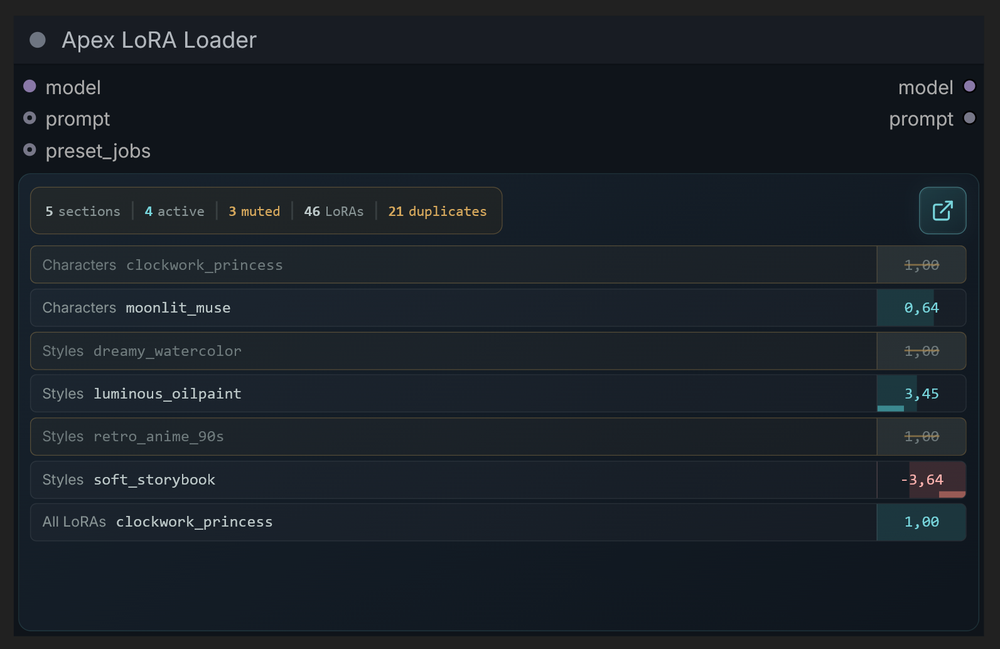
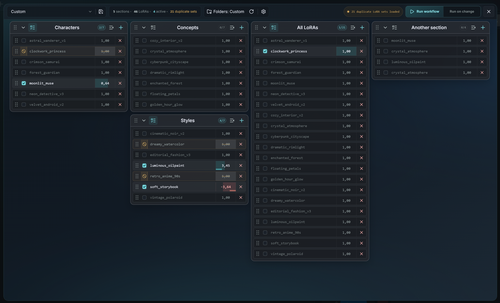
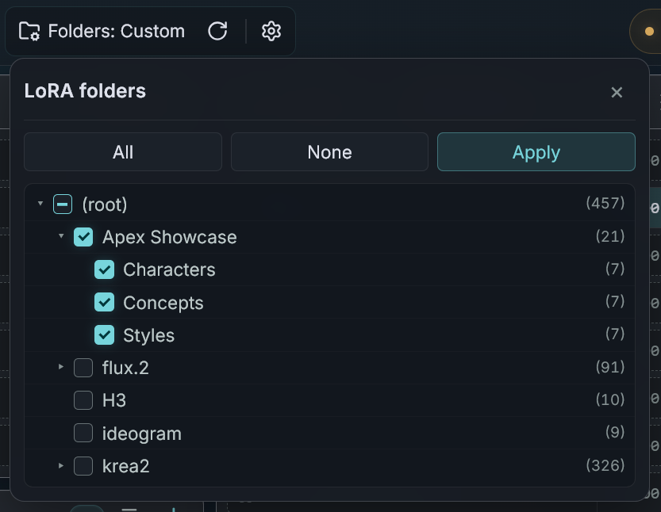
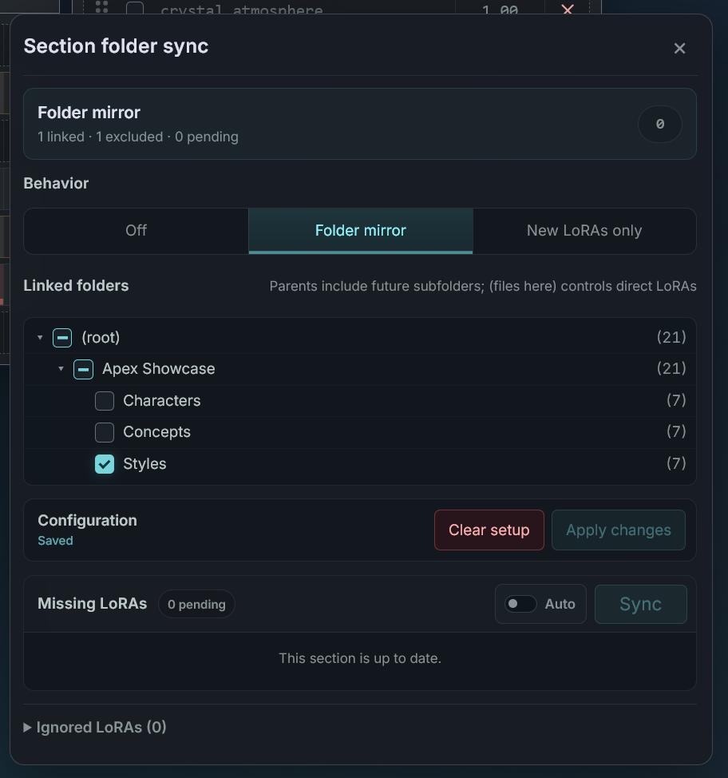
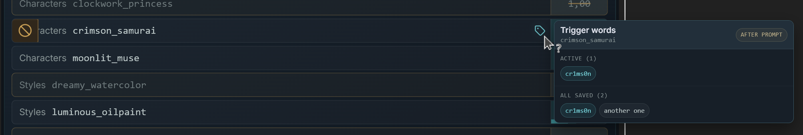
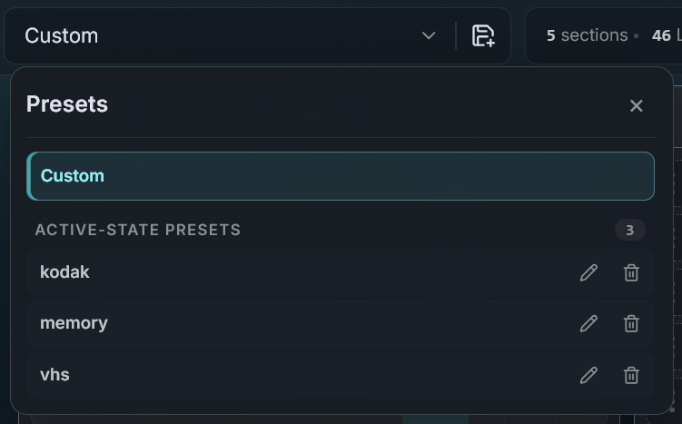
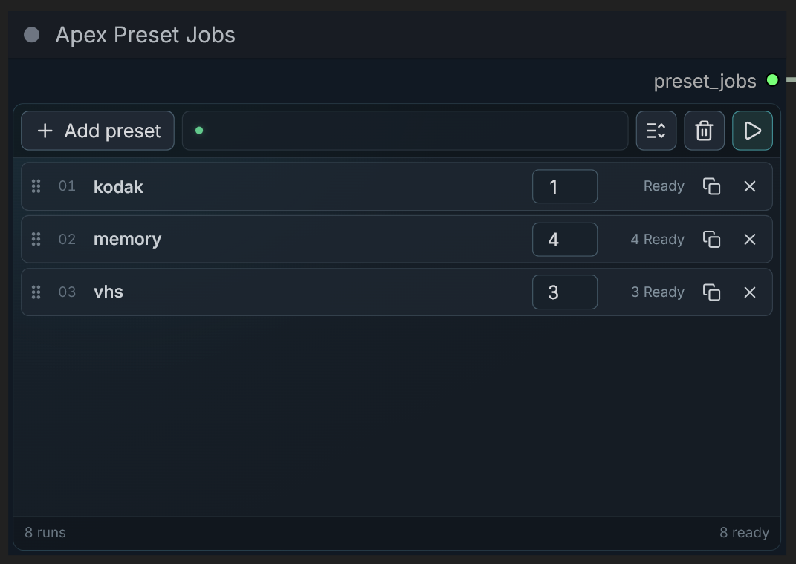
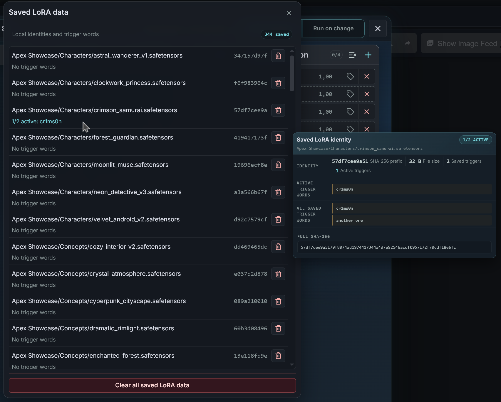
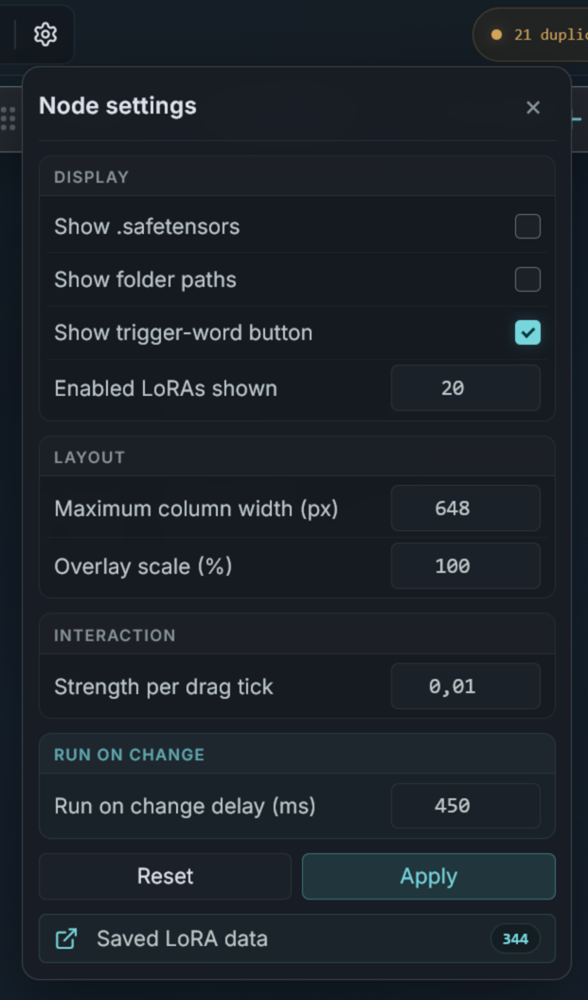

# Apex LoRA Loader

### A powerful, organized LoRA workspace for ComfyUI

Build large LoRA stacks, keep them manageable, and control exactly what reaches the model.

[![License: MIT][license-shield]][license-link]
[![Version: v0.5.6][version-shield]][version-link]
[![ComfyUI Custom Node][comfyui-shield]][comfyui-link]
[![Local only][local-shield]][local-link]
[![No extra packages][dependencies-shield]][dependencies-link]

  
   
  A compact workflow node backed by a full sectioned LoRA editor.

> [!NOTE]
> **Fully vibe coded.** Product direction, testing, and iteration were human-led; implementation was produced with OpenAI Codex.

## Overview

Apex LoRA Loader is a MODEL-only LoRA loader for ComfyUI. The workflow node stays compact and shows the LoRAs that matter, while its fixed overlay editor provides the full stack, folder, preset, trigger-word, and synchronization controls.

LoRAs are applied through ComfyUI's standard model patching path in visible stack order. An optional prompt connection passes text through the node and inserts selected trigger words. The independent **Apex Preset Jobs** companion can queue several saved LoRA combinations from the same workflow.

| Port | Direction | Purpose |
| --- | --- | --- |
| `model` | Input | Diffusion model to patch. |
| `prompt` | Optional input | Prompt to augment with active trigger words. |
| `preset_jobs` | Optional input | Control link from Apex Preset Jobs. Normal workflow execution does not require it. |
| `model` | Output | Model patched with the active LoRA stack. |
| `prompt` | Output | Prompt with selected trigger words prepended or appended. |

The node intentionally has no CLIP socket. LoRAs are applied to `MODEL` with zero CLIP strength.

---

## Core workflow

### Compact node and overlay editor

The node itself is a lightweight preview designed to remain practical on the ComfyUI canvas. It shows stack totals and enabled LoRAs with their current strengths, trigger-word state, missing-file state, and temporary mute state. The number of visible LoRAs is configurable from 5 to 99.

Use the editor button to open the full interface. The overlay belongs to that loader node and edits its serialized workflow state directly. It can be resized, scaled from Settings, closed without losing changes, and used to queue the workflow. Middle-mouse dragging over the compact node passes through to normal canvas panning.

  
   
  Manage the complete stack in the overlay while the workflow node remains compact.

### Sections, columns, and ordering

Every LoRA lives in a named section. Sections can be collapsed, renamed, reordered, moved between columns, enabled or disabled as a group, and deleted with confirmation. LoRA rows can be reordered within a section or dragged into another section using full-width insertion targets.

Columns are manual vertical lanes rather than an automatically balanced masonry layout. Each lane stacks independently, so a tall section does not create gaps beneath neighboring columns. When the editor narrows, unavailable columns merge deterministically and return when space becomes available again. The maximum column width is configurable per node.

Visual order is execution order: columns are processed from left to right, and sections and rows run from top to bottom within each column.

### Adding and selecting LoRAs

The section add button opens a searchable LoRA chooser. Add one file, use **Add all LoRAs** to populate the section from the current picker scope, or open that section's Folder Sync controls.

Node-wide folder filters determine what the chooser offers without affecting rows already in the stack. The compact folder tree supports:

- All LoRAs, no LoRAs, or any combination of folders.
- Recursive parent-folder selection.
- Explicitly included or excluded subtrees.
- Separate **(files here)** choices for files directly inside a folder.
- Tri-state parent controls, per-folder counts, and remembered expansion state.

  
   
  Limit each loader's picker with a compact recursive folder tree.

ComfyUI's **Refresh Node Definitions** updates Apex's lightweight filename and folder catalog. Apex's own rescan performs the slower identity and rename verification when needed.

### Folder Sync

A section can link to one or more folders and detect LoRAs missing from that section. Folder Sync is add-only: it never removes stack rows or enables synchronized LoRAs automatically.

| Mode | Behavior |
| --- | --- |
| **Off** | Pauses detection while preserving the section's folder rules. |
| **Folder mirror** | Offers every eligible file not already represented in the section. |
| **New LoRAs only** | Records the current files as a baseline and offers files discovered afterward. |

Folder Sync respects the node-wide folder filters. Pending files can be synchronized, ignored, or allowed again later. Removing, moving, or replacing a managed row records its identity as ignored so synchronization does not immediately restore it.

Enable **Auto Sync** to verify and append detected files after workflow loading or catalog refresh. Manual and automatic additions start disabled and do not trigger Run on Change. Badges and combined ComfyUI notifications report detected or synchronized files. When several sections have pending files, **Sync all** verifies them in one operation; its tooltip lists each destination section and LoRA before you run it.

  
   
  Link individual sections to the folders they manage and synchronize missing LoRAs.

---

## LoRA controls

### Strength

Strengths are clamped to `-100..100`, stored with at most two decimal places, and displayed in fixed comma-decimal form such as `1,00` or `-0,57`.

- Click the field and type an exact value using a comma or period.
- Drag horizontally to adjust it without selecting the text.
- Configure the exact strength step used by each drag tick.

The field visualizes the fractional value as a continuous fill. Values beyond `1.00` also use a capped ten-block magnitude layer, mirrored for negative strengths.

### Temporary mute

Right-click a LoRA row to temporarily set its effective strength to `0.00` without disabling the row or overwriting its saved strength. The compact node also exposes an amber mute control on row hover; the overlay replaces the enabled checkbox with an amber restore control while the override is active.

A muted LoRA contributes neither a model patch nor trigger words. Unmuting restores its saved strength immediately. The override follows the row through reordering, workflow serialization, rename recovery, and Full setup presets. Applying an Active LoRAs preset clears the override on matched rows.

### Trigger words

Trigger words are optional local metadata associated with a LoRA identity; Apex never writes them into the `.safetensors` file. Each LoRA can store several trigger words, with zero, one, or many selected at the same time.

The tag editor lets you add, select, and remove trigger words and choose whether that row places its active words before or after the incoming prompt. Only enabled, unmuted, nonzero-strength rows contribute words, following visual stack order. Metadata is keyed by SHA-256 so it survives file and folder renames.

The row tag button is hidden by default and can be enabled in Settings. On the compact node, its tooltip summarizes saved and active words without opening the editor.

  
   
  Inspect active and saved trigger words directly from the compact node.

---

## Presets

Presets are shared across Apex LoRA Loader nodes and workflows in the same ComfyUI installation. The custom preset menu separates both preset types and provides inline rename and delete controls.

| Preset type | What it stores | What applying it changes |
| --- | --- | --- |
| **Active LoRAs** | Enabled LoRA identities and strengths. | Disables current rows, then enables and restores matching rows without changing sections, ordering, filters, or trigger configuration. |
| **Full setup** | Complete sections, columns, rows, states, strengths, filters, Folder Sync configuration, settings, and trigger placement. | Replaces the loader setup after confirmation. |

Identity matching prefers SHA-256 and falls back to exact filenames when no usable hash exists. Missing preset entries are reported but never inserted automatically. Duplicate identities are matched one-to-one in current row order, and empty presets are valid.

  
   
  Save lightweight active combinations or restore a complete loader setup.

### Apex Preset Jobs

> [!WARNING]
> **Apex Preset Jobs is experimental.** It has received less real-world testing than Apex LoRA Loader, so review queued jobs and workflow results carefully.

**Apex Preset Jobs** is an optional companion node for queueing an ordered list of Active LoRAs presets. Connect its `preset_jobs` output to one Apex LoRA Loader, add presets to the job list, arrange or duplicate them, and press Queue Jobs.

- Each expanded job becomes one normal ComfyUI prompt submission.
- Grouped view combines adjacent identical jobs into an adjustable `×N` row.
- Jobs store frozen snapshots, so later preset edits or deletion do not rewrite them.
- The connected loader's sections, filters, trigger configuration, and ordering stay intact.
- Invalid jobs are skipped individually with a reason; valid jobs continue in order.
- Statuses distinguish ready, submitting, queued, running, completed, failed, interrupted, skipped, and not submitted.

The standard ComfyUI Queue button still runs the visible loader state once. Queue Jobs temporarily substitutes each frozen state only while ComfyUI builds that prompt, then restores the visible state. Normal seed controls run once per submitted job, so randomize, increment, and decrement modes behave as they do for ordinary queues.

  
   
  Arrange saved LoRA combinations into a repeatable multi-run queue.

---

## Identity, recovery, and diagnostics

### Rename-safe identities

Selecting a LoRA records its canonical relative path, file size, and SHA-256 digest. Exact existing paths always win. If a path disappears, Apex hashes only same-size candidates and updates the row when the digest identifies a renamed file. Changed contents are treated as a different LoRA.

Distinct rows with the same verified SHA-256 identity are reported as a duplicate set in the node summary. Identity hashes are cached as a bounded collection of strings; loaded tensor dictionaries exist only for the current execution.

### Saved LoRA data

Settings provides a dedicated Saved LoRA Data manager for locally stored identities and trigger words. It shows each filename, hash prefix, file size, saved words, and active words. Individual records can be removed directly, while **Clear all saved LoRA data** requires confirmation and explains exactly what will be deleted.

Deleting saved data does not delete LoRA files, stack rows, sections, presets, or folder settings. Identity records are recreated when those LoRAs are identified again; deleted trigger words are not automatically restored unless another workflow still carries them.

  
   
  Inspect locally saved identities and trigger words, or remove records that are no longer needed.

### Execution diagnostics

For an uncached run, Apex writes a collapsed browser-console report based on the patches returned by ComfyUI's own `load_lora_for_models` call. It separates applied LoRAs, incompatible files that installed no model patches, intentionally skipped rows, and loading failures. When ComfyUI reuses the loader's cached output, Apex reports that no fresh core calls were made.

Diagnostics are observational and do not replace or modify ComfyUI's loading behavior.

---

## Settings and Run on Change

Settings are stored per loader node and preserved by Full setup presets. They control:

- `.safetensors` extension and folder-path visibility.
- Trigger-word button visibility.
- Number of enabled LoRAs shown on the compact node.
- Maximum section-column width.
- Overlay interface scale.
- Strength drag increment.
- Run on Change delay.

The overlay header can run the workflow directly. Enable **Run on Change** on that button to queue after a committed LoRA state or strength change. Strength dragging queues only after the interaction finishes, and further changes during the delay replace the pending state so the latest state is submitted. The toggle is remembered per node.

  
   
  Adjust display, layout, strength interaction, and Run on Change behavior per loader.

---

## Installation

From the ComfyUI directory:

~~~bash
cd custom_nodes
git clone https://github.com/lericogit/apex-lora-loader.git
~~~

Restart ComfyUI, hard-refresh the browser, then add **Apex LoRA Loader** from `loaders/Apex`. **Apex Preset Jobs** is available in the same category.

No additional Python or JavaScript packages are required.

## Quick start

1. Connect a `MODEL` input.
2. Open the editor and create or rename a section.
3. Optionally configure the node-wide folder picker.
4. Add LoRAs, enable the rows you want, and set their strengths.
5. Drag rows and sections into the required application order.
6. Optionally connect `prompt` and enable trigger-word controls in Settings.
7. Save reusable combinations as Active LoRAs presets or preserve everything with a Full setup preset.
8. Queue from ComfyUI normally, from the overlay, through Run on Change, or with Apex Preset Jobs.

---

## Loading and compatibility

Apex delegates LoRA application to ComfyUI's standard model path:

1. Resolve with `folder_paths.get_full_path_or_raise`.
2. Load with `comfy.utils.load_torch_file(..., safe_load=True, return_metadata=True)`.
3. Apply with `comfy.sd.load_lora_for_models`, using the row's model strength and zero CLIP strength.

Enabled, unmuted, nonzero-strength rows are applied sequentially in visual order. Disabled, muted, and zero-strength rows are skipped. An enabled row that cannot be resolved fails clearly rather than silently loading another file.

Loaded LoRA state dictionaries may be reused by repeated rows during one node execution and are discarded afterward. Repeated rows still apply as separate ordered patches.

Because patch application belongs to the incoming ComfyUI model patcher, native INT8 ConvRot models can use ordinary BF16/FP16 LoRAs through Apex. Specialized model loaders retain the behavior of their own patcher; Apex adds no separate quantization path.

## Data and privacy

| Data | Scope | Storage |
| --- | --- | --- |
| Sections, rows, ordering, filters, settings, and trigger placement | Per node/workflow | Hidden versioned JSON serialized by ComfyUI |
| Preset Jobs list and view mode | Per helper node/workflow | Separate hidden versioned JSON serialized by ComfyUI |
| Preset Jobs execution results | Current browser session | Memory only |
| Active LoRAs and Full setup presets | Installation-wide | `ComfyUI/user/__apex_lora_loader/presets.json` by default |
| Hashes and trigger-word metadata | Installation-wide | `ComfyUI/user/__apex_lora_loader/lora_metadata.json` by default |
| Loaded LoRA tensors | Current execution only | Memory |

Apex follows ComfyUI's configured system user directory. It performs no downloads, telemetry, analytics, or remote metadata lookups.

---

## Credits and provenance

Apex's original implementation was created for this project. No source from the reference-only custom nodes below is bundled; they are credited for APIs, interaction patterns, and compatibility research that informed the design.

| Project | Relationship | Apex implementation |
| --- | --- | --- |
| [ComfyUI](https://github.com/Comfy-Org/ComfyUI) | Runtime foundation and canonical LoRA APIs. | Ordered stack orchestration, overlay UI, presets, filtering, identity recovery, and prompt metadata. |
| [rgthree-comfy Power LoRA Loader](https://github.com/rgthree/rgthree-comfy) | UX reference for compact LoRA controls, reordering, and horizontal strength dragging. | Named manual columns, Folder Sync, global presets, trigger arrays, and prompt routing. |
| [Fantastic LoRAs](https://github.com/Adudeguyman/comfyui_fantastic-loras) | Design reference for searchable rows, per-node filtering, and a compact collapsible folder tree. | Recursive rules, direct-file overrides, remembered tree state, identity recovery, and section-level synchronization. |
| [ComfyUI-Lora-Auto-Trigger-Words](https://github.com/idrirap/ComfyUI-Lora-Auto-Trigger-Words) | Concept reference for associating LoRAs, hashes, and trigger words. | Local manual metadata, multiple active choices, editable chips, and per-row prompt placement. |
| [ComfyUI-KJNodes](https://github.com/kijai/ComfyUI-KJNodes) | Technical reference while reviewing LoRA application patterns. | Apex remains model-agnostic and delegates model patching to ComfyUI core. |
| [ComfyUI-INT8-Fast](https://github.com/BobJohnson24/ComfyUI-INT8-Fast) | Compatibility reference for LoRAs used with INT8 ConvRot models. | No INT8-Fast code or quantization math is included; Apex respects the incoming model patcher. |
| [Lucide](https://github.com/lucide-icons/lucide) | Source of embedded interface SVG path data. | Icons render locally with `currentColor`; no runtime icon package is required. |
| [OpenAI Codex](https://openai.com/codex/) | Implementation partner for the fully vibe-coded development process. | Human-directed design, testing, refinement, and acceptance shaped the final behavior. |

## License

Apex LoRA Loader's original code is released under the [MIT License](LICENSE).

Embedded Lucide icons retain their ISC terms, and Feather-derived Lucide icons retain their MIT terms. Required notices are preserved in [THIRD_PARTY_NOTICES.md](THIRD_PARTY_NOTICES.md). ComfyUI and every referenced project remain governed by their respective licenses.

[license-shield]: https://img.shields.io/badge/license-MIT-2ea44f?style=flat-square
[license-link]: LICENSE
[version-shield]: https://img.shields.io/badge/version-v0.5.6-1f6feb?style=flat-square
[version-link]: https://github.com/lericogit/apex-lora-loader/releases
[comfyui-shield]: https://img.shields.io/badge/ComfyUI-custom_node-6f42c1?style=flat-square
[comfyui-link]: https://github.com/Comfy-Org/ComfyUI
[local-shield]: https://img.shields.io/badge/network-local_only-0a7f5a?style=flat-square
[local-link]: #data-and-privacy
[dependencies-shield]: https://img.shields.io/badge/extra_dependencies-none-4c8bf5?style=flat-square
[dependencies-link]: #installation
